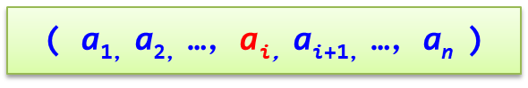
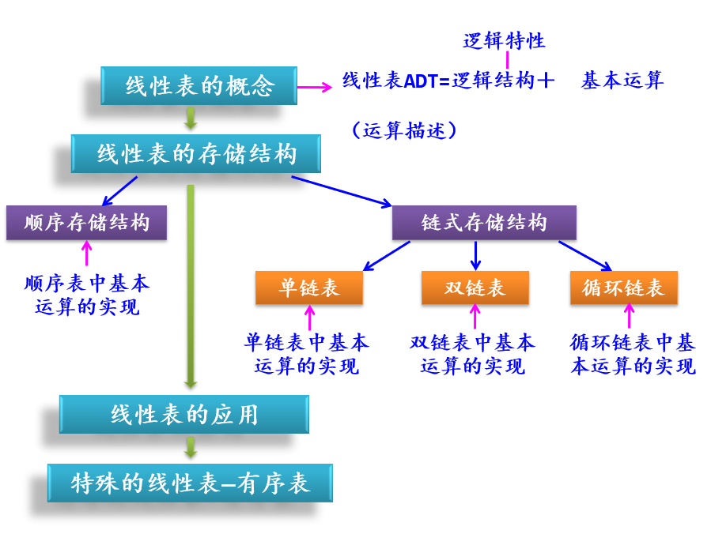
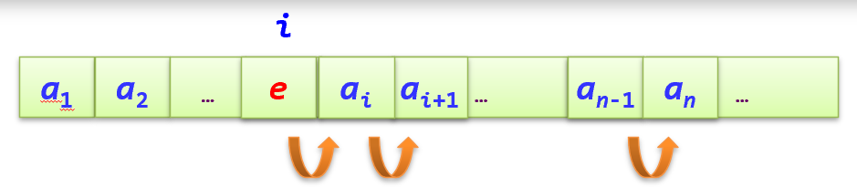
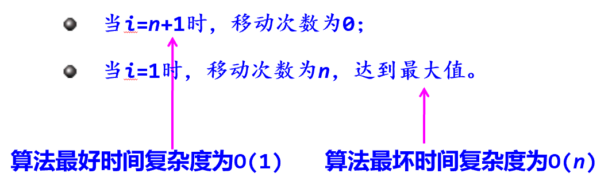
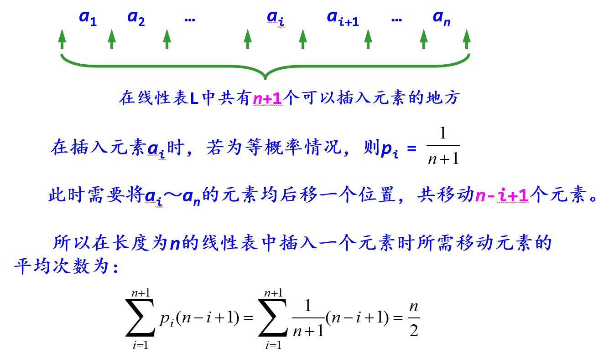

# 线性表
## 1. 线性表的基本概念
#### 定义
* 线性表是一个具有相同特性的数据元素的有限序列。
__同一性__：所有元素属于同一数据类型。
__有限性__：数据元素个数是有限的。
__有序性__：数据元素由逻辑序号唯一确定。一个线性表中可以有相同值的元素。
* 线性表中所含元素的个数叫做线性表的长度，用n表示，n≥0。n=0时，表示线性表是一个空表，即表中不包含任何元素。
####　线性表的逻辑表示

####　基本运算
初始化线性表InitList(&L)：构造一个空的线性表L。

销毁线性表DestroyList(&L)：释放线性表L占用的内存空间。

判线性表是否为空表ListEmpty(L)：若L为空表，则返回真，否则返回假。

求线性表的长度ListLength(L)：返回L中元素个数n。

输出线性表DispList(L)：线性表L不为空时，顺序显示L中各结点的值域。

求线性表L中指定位置的某个数据元素GetElem(L，i，&e)：用e返回L中第 i（1≤i≤n）个元素的值。

定位查找LocateElem(L，e)：返回L中第一个值域与e相等的逻辑位序。若这样的元素不存在，则返回值为0。

插入一个数据元素ListInsert(&L，i，e)：在L的第i（1≤i≤n）个元素之前插入新的元素e，L的长度增1。

删除数据元素ListDelete(&L，i，&e)：删除L的第i（1≤i≤n）个元素，并用e返回其值，L的长度减1。
#### 线性表的知识结构

## 2. 线性表的顺序储存结构
线性表的顺序存储结构：把线性表中的所有元素按照顺序储方法进行存储。
=> 按逻辑顺序依次存储到存储器中一片连续的存储空间中。
```c
typedef struct 
{  
    ElemType data[MaxSize];
    int length;
} SqList;    	//顺序表类型
```
其中data成员存放元素，length成员存放线性表的实际长度。

### 顺序表运算的实现
#### 0. 整体建立顺序表CreateList(L, a, n)
 数组$a[0,1,2...n-1]$=>顺序表
```c
// 整体建立顺序表
void CreateList(SqList *L, ElemType a[], int n){  
    int i=0,k=0;
    L=(SqList *)malloc(sizeof(SqList));
    while (i<n)		// i扫描a中元素
    {  
        L->data[k]=a[i];
        k++; i++;	// k记录插入到L中的元素个数
    }
    L->length=k;
}
```
#### 1. 初始化线性表InitList(L)
该运算的结果是构造一个空的线性表L。实际上只需将length成员设置为0即可。       
```c
void InitList(SqList *&L)
{
    //分配存放线性表的顺序表空间
    L=(SqList *)malloc(sizeof(SqList));
    L->length=0;
}
```

#### 2. 销毁线性表DestroyList(L)
该运算的结果是释放线性表L占用的内存空间。
```c
// 销毁线性表
void DestroyList(SqList *L)
{
    free(L);
}
```
free(L)释放L所指向的空间

    顺序表采用指针传递，有两个优点：
    · 更清楚看到顺序表创建和销毁的过程
    · 在算法的函数之间传递更加节省空间（在函数体内不必再创建值形参即整个顺序表的副本）

#### 3. 判定是否为空表ListEmpty(L)
该运算返回一个值表示L是否为空表。若L为空表，则返回true，否则返回false。
```c
// 判定是否为空表
bool ListEmpty(SqList *L)
{
    return(L->length == 0);
}
```

#### 4. 求线性表的长度ListLength(L)
该运算返回顺序表L的长度。实际上只需返回length成员的值即可。
```c
// 求线性表的长度
int ListLength(SqList *L)
{
    return(L->length);
}
```

#### 5. 输出线性表DispList(L)
该运算当线性表L不为空时，顺序显示L中各元素的值。     
```c
// 输出线性表
void DispList(SqList *L)
{  
    int i;
    if (ListEmpty(L))
        return;
    for (i=0; i < L->length; i++)
        printf("%c", L->data[i]);
    printf("\n");
}  
```

#### 6. 求某个数据元素值GetElem(L，i，e)
该运算返回L中第 $i (1 ≤ i ≤ ListLength(L))$个元素的值，存放在e中。
```c
// 求某个数据元素值
bool GetElem(SqList *L，int i，ElemType &e)
{     
    if (i < 1 || i > L->length)
        return false;
    e = L->data[i-1];
    return true;
}  
```
本算法的时间复杂度为O(1) => 体现顺序表的随机存取特性

#### 7. 按元素值查找LocateElem(L，e)
该运算顺序查找第1个值域与e相等的元素的逻辑位序。若这样的元素不存在，则返回值为0。
```c
// 按元素值查找
int LocateElem(SqList *L, ElemType e)
{  
    int i = 0;
    while (i < L->length && L->data[i] != e)  
        i++;
    if (i >= L->length)
        return 0;
    else
        return i+1;
}
```

#### 8. 插入数据元素ListInsert(L，i，e)
该运算在顺序表L的第i（1≤i≤ListLength(L)+1）个位置上插入新的元素e。    
```c
// 插入数据元素
bool ListInsert(SqList *L, int i, ElemType e)
{  
    int j;
    if (i<1 || i>L->length+1)
        return false;                   // 参数错误时返回false
    i--;                                // 将顺序表逻辑序号转化为物理序号
    for (j = L->length; j > i; j--)     // 将data[i..n]元素后移一个位置
	    L->data[j]=L->data[j-1];
    L->data[i] = e;                     // 插入元素e
    L->length++;                        // 顺序表长度增1
    return true;                        // 成功插入返回true
}
```

对于本算法来说，元素移动的次数不仅与表长 L->length = n有关，而且与插入位置i有关

##### 平均情况分析

## 3. 线性表的链式储存结构
## 4. 线性表的应用
## 5.有序表